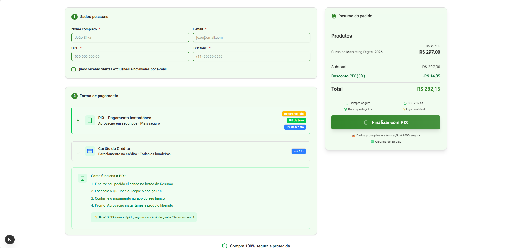

# 🧪 Projeto com Next.js — Teste Técnico Cakto

Este projeto foi desenvolvido utilizando **Next.js 15 com App Router** e foi estruturado com foco em:

- 🧱 Escalabilidade
- ⚙️ Performance
- 🧼 Organização de código
- 🧑‍💻 Experiência do desenvolvedor e do usuário

---

## 📐 Arquitetura e Estrutura

A base do projeto segue os princípios do **Atomic Design**, organizando os componentes em:

- `atoms`
- `molecules`
- `organisms`
- `templates`
- `pages`

### 🗂️ Organização por domínio (Feature-based)

Cada componente está **encapsulado em sua respectiva pasta** de acordo com a página ou contexto ao qual pertence. Isso facilita:

- A **manutenção** futura
- O **entendimento** do código
- A **localização rápida** de partes específicas

---

## 🔧 Estrutura Interna dos Componentes

Cada componente possui uma organização interna padrão, seguindo a nomenclatura:

```
MeuComponente/
├── variables/         # Pasta caso necessário de variáveis do componente
|   ├── index.ts(x)    # Arquivo com variáveis(Ex: Variants) utilizados no componente específico
├── MeuComponente.comp.tsx         # Componente principal
├── MeuComponente.interface.ts     # Tipos e interfaces relacionados
├── MeuComponente.skeleton.tsx     # Utilizado quando necessário o Skeleton para lazy loading
├── index.ts                       # Arquivo de exportação
```

Essa estrutura permite que cada componente **contenha tudo que é necessário para seu funcionamento**, promovendo encapsulamento e organização.

---

## 🧩 Agrupamento de Componentes via Objeto

Os componentes relacionados são agrupados em **objetos únicos exportáveis**. Essa abordagem:

- Melhora a **organização**
- Facilita o **lazy loading com `next/dynamic`**
- Centraliza a manipulação e uso dos componentes

Exemplo de uso:

```tsx
<SummaryComponents.Product ... />
<SummaryComponents.Total ... />
```

---

## 💅 UI e Design System

O projeto utiliza a biblioteca **[ShadCN UI](https://ui.shadcn.dev/)** como base do sistema de design. Essa UI foi:

- **Abstraída em componentes próprios**, mantendo a identidade visual
- **Reutilizada com consistência** em todo o app
- **Utiliza o conceito de Mobile-First** em todo o app

---

## ✅ Formulários e Validações

- **React Hook Form** é utilizado para controle dos formulários, garantindo performance e facilidade de integração.
- **Zod** é usado para validação, com schemas dedicados e mensagens de erro amigáveis.

---

## ✅ Erros

O projeto trata os erros utilizando o **ErrorBoundary** e também o retorno da request, tratando cada campo de forma individual. Também foi criado uma página de Erro Customizada para a aplicação em paralelo a um componente específico para esse cenário.

## ✅ Função de Cálculo

A função foi desenvolvida com base na seguinte lógica:

- **Cartão à vista:** 3,99% de taxa
- **Cartão parcelado:** 4,99% de taxa base + 2% para cada parcela adicional além da primeira

### 💡 Exemplo de cálculo:

- **Cartão à vista:**  
  Taxa = **3,99%**

- **Cartão em 2 parcelas:**  
  Taxa = **4,99%** + **2%** (1 parcela adicional) = **6,99%**

- **Cartão em 3 parcelas:**  
  Taxa = **4,99%** + **2% × 2** = **8,99%**

Ou seja, a primeira parcela tem uma taxa base de 4,99%, e cada parcela extra adiciona 2% de taxa.

---

## 🔌 Integrações e Simulações

- As requisições são organizadas na pasta `services/`.
- O projeto simula uma requisição inicial com **delay de 2 segundos** para imitar carregamento real.
- No submit, uma chamada de exemplo é feita para uma API interna (`/api/checkout/save`) que também tem um **delay de 2 segundos**.

---

## 🧠 Server Components x Client Components

O projeto faz uso estratégico dos **Server Components** para:

- Melhorar o tempo de carregamento
- Reduzir o bundle do lado do cliente

Os **Client Components** são usados **apenas quando necessário**, como em formulários ou interações com o estado local.

---

## 📁 Estrutura de Pastas

| Pasta         | Descrição                                                       |
| ------------- | --------------------------------------------------------------- |
| `app/`        | Contém rotas, páginas e APIs da aplicação (Next.js App Router)  |
| `components/` | Componentes organizados por Atomic Design e por contexto de uso |
| `fonts/`      | Fontes utilizadas na aplicação                                  |
| `lib/`        | Bibliotecas utilitárias (ShadCN, Skeleton, Toast, etc.)         |
| `services/`   | Integrações com APIs e simulações de requisição                 |
| `utils/`      | Funções auxiliares de formatação e manipulação de dados         |

---

## 🎯 Objetivo

O projeto foi pensado com foco em:

- **Manutenibilidade a longo prazo**
- **Experiência do usuário**
- **Performance no carregamento**
- **Boas práticas modernas com Next.js**

---

## 🛠️ Tecnologias Principais

- **Next.js (App Router)**
- **React 19**
- **TypeScript**
- **ShadCN UI**
- **React Hook Form + Zod**
- **ESLint**
- **Atomic Design**
- **Dynamic Imports com `next/dynamic`**

---

<br><br>

# Como Rodar o Projeto

1 - Primeiro você de ter o node instalado, caso tenha basta utilizar o seguinte comando:

```bash
npm i
# ou caso tenha o yarn instalado
yarn
# ou caso tenha o pnpm instalado
pnpm i
```

2 - Após a instalação das dependências basta rodar o seguinte comando

```bash
npm run dev
# ou caso tenha o yarn instalado
yarn dev
# ou caso tenha o pnpm instalado
pnpm dev
```

Abra [http://localhost:3000](http://localhost:3000) em seu navegador para ver o resultado.

<br></br>

## Tela de Checkout


